# SPRED Manual 초안

이 문서는 현재 프로그램에 바로 적용하기 전, 문체와 설명 순서를 검토하기 위한 임시 초안입니다.

피드백, 버그 제보, 개선 의견 환영합니다. 제작자 이메일: `fav_09@naver.com`

매뉴얼의 원본은 한글로 작성되었으며, 이외의 언어로 된 매뉴얼은 AI 번역과 최소한의 검수를 거친 번역본임을 밝힙니다. 내용이 부정확하면 제보 부탁드립니다.

업데이트에 따라 매뉴얼과 달라지거나 추가된 기능이 있을 수 있습니다. 매뉴얼의 최종 갱신일은 --입니다.

아직 테스트 단계의 웹 앱입니다. 부족한 점이 있을 수 있습니다.

<strong>1. 시작하기</strong>

전세계 오타마토니스트 여러분 안녕하십니까?

<strong>1.1. SPRED 소개</strong>

SPRED는 오타마톤같은 프렛리스 악기를 위해 개발된 악보 작성 / 재생 / 연습 보조용 도구입니다.

별도의 프로그램 설치 없이 바로 웹 페이지에서 이용 가능합니다.

주요 기능은 아래와 같습니다.

- 악보 JSON 불러오기 / 저장하기
- 피아노롤 악보 재생
- 악보 제작과 편집
- 악보 양식 변경
- YouTube 영상과 악보 재생 싱크
- 음정과 박자 평가 기능

<strong>1.2. 권장 환경</strong>

- PC + Chrome 브라우저를 중심으로 개발하고 있습니다.
- 모바일에서도 악보 로드 / 재생은 가능하지만 기본 지원 대상은 아닙니다. 일부 기능은 불편하거나 동작하지 않을 수 있습니다.

<strong>1.3. 권장 사양</strong>

현재 권장 사양은 테스트를 통해 정리 중입니다. 우선은 최신 Chrome 계열 브라우저가 원활하게 동작하는 PC 환경을 권장합니다.

긴 악보, YouTube sync, practice mode는 기기 성능과 브라우저 상태에 영향을 받을 수 있습니다.

<strong>2. 상단 메뉴</strong>

상단 메뉴는 화면 위치에 따라 왼쪽 메뉴 영역, 중앙 플레이어 영역, 오른쪽 YouTube 영역으로 나눌 수 있습니다.

<strong>2.1. 왼쪽: 메뉴 영역</strong>

메뉴 영역에서는 프로그램의 각종 설정을 조정합니다.

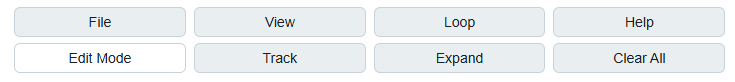

<strong>File</strong>

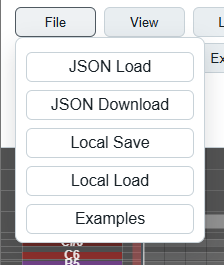

악보 파일을 로드하거나 저장합니다. 기본적으로 악보의 확장자는 `.json`입니다.

| 항목 | 설명 |
| --- | --- |
| JSON Load | 로컬 Score JSON 파일을 불러옵니다. |
| JSON Download | 현재 악보를 JSON 파일로 다운로드합니다. |
| Local Save | 현재 브라우저의 local storage에 악보를 임시 저장합니다. |
| Local Load | 같은 브라우저에 저장해둔 악보를 다시 불러옵니다. |
| Examples | 테스트용 예제 악보 목록을 불러옵니다. 현재는 베타테스터용 access word가 필요합니다. |

주의: 제3자가 제작한 JSON 파일을 로드하고자 하는 경우, 사전에 안전한 파일인지 확인하는 것을 권장합니다. 장기 보관이나 공유에는 Local Save보다 JSON Download를 사용하세요.

<strong>View</strong>

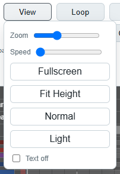

악보의 시각적 설정을 변경합니다.

| 항목 | 설명 |
| --- | --- |
| Zoom | 악보 전체 배율을 조정합니다. |
| Speed | 악보 cell의 가로 길이를 조정합니다. 실제 재생 시간이나 BPM은 바뀌지 않습니다. |
| Fullscreen | 앱 화면을 전체 화면으로 전환합니다. |
| Fit Height | 현재 화면 높이에 맞춰 악보가 보이도록 배율을 조정합니다. |
| Normal / Reverse | 악보의 위아래 표시 방향을 전환합니다. |
| Light / Dark | 색상 테마를 변경합니다. |
| Text off | 노트 위의 텍스트 표시를 끕니다. global row 텍스트는 계속 보입니다. |

<strong>Loop</strong>

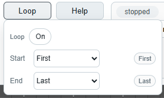

악보의 특정 영역을 선택하여 루프할 수 있습니다.

| 항목 | 설명 |
| --- | --- |
| Loop On / Off | 루프를 끄고 켭니다. |
| Start | 시작 시점을 설정합니다. 기본값은 악보 전체의 시작 시점입니다. |
| End | 종료 시점을 설정합니다. 기본값은 악보 전체의 종료 지점입니다. |
| Select Column | 선택 후 악보의 한 점을 클릭하면 시작 또는 종료 시점을 변경할 수 있습니다. |

주의: 현재 매뉴얼 초안에서는 루프 UI 설명만 다룹니다. 실제 반복 재생 연결 상태는 테스트 빌드의 최신 구현을 기준으로 확인하세요.

<strong>Edit Mode</strong>

악보 편집 모드로 전환합니다. Edit Mode를 켠 뒤 악보 cell을 클릭하면 선택한 입력 도구와 활성 track 기준으로 악보가 수정됩니다.

세부 입력 방법은 이후 편집 항목에서 따로 설명할 예정입니다.

<strong>Track</strong>

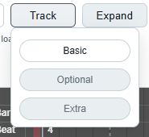

활성화할 트랙을 선택합니다. 현재 버전에는 `Basic`, `Optional`, `Extra` 세 종류가 있으며, 각기 다른 색으로 구분합니다.

- 비활성화된 track은 화면에서 반투명하게 표시됩니다.
- 비활성화된 track은 재생 시 소리가 나지 않습니다.
- track별 노트는 독립적으로 저장됩니다.
- 여러 트랙을 동시에 켜고 노트를 찍으면 활성화된 트랙들에 동시에 입력될 수 있습니다.

<strong>Expand</strong>

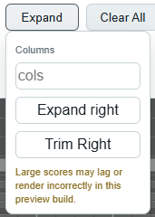

악보의 길이를 변경합니다.

| 항목 | 설명 |
| --- | --- |
| Columns | 확장 또는 정리할 기준 칸 개수를 입력합니다. |
| Expand Right | 입력한 열 수만큼 오른쪽으로 공간을 추가합니다. |
| Trim Right | 오른쪽의 불필요한 빈 공간을 정리합니다. |

주의: 너무 긴 악보는 기기 성능에 영향을 줄 수 있습니다. 필요한 만큼 나누어 확장하는 것을 권장합니다.

<strong>Clear All</strong>

악보 전체를 비우고 초기 기본 상태로 되돌아갑니다.

주의: 작업 중인 악보를 잃지 않도록 사용 전 `JSON Download`로 백업하세요.

<strong>2.2. 중앙: 플레이어 영역</strong>

전체적으로 일반적인 음악 플레이어와 비슷합니다.

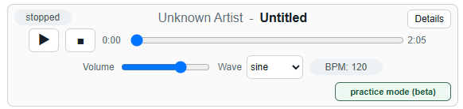

<strong>재생 관련 기능</strong>

| 항목 | 설명 |
| --- | --- |
| 재생, 정지 | 보편적인 미디어 플레이어와 동일하게 동작합니다. |
| 재생바 | 현재의 진행 상태를 나타냅니다. 드래그하여 악보를 슬라이드할 수도 있습니다. |
| Volume, Wave | 악보 노트의 볼륨과 소리 유형을 결정합니다. |

<strong>Details</strong>

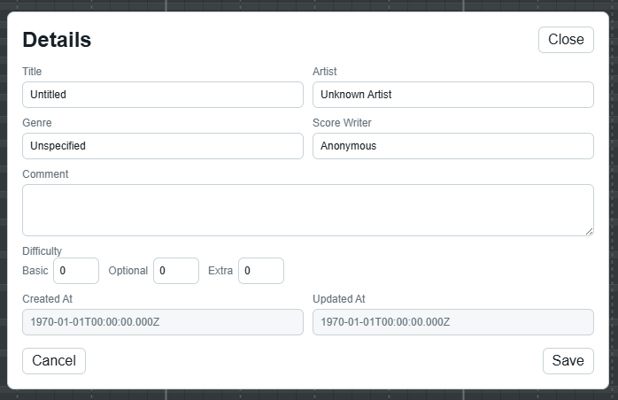

악보의 정보를 열람하고 편집할 수 있습니다. 단, 생성일과 수정일은 저장 시점을 기준으로 자동 갱신되며 사용자가 직접 수정할 수 없습니다.

편집 후 `Save`를 누르면 정보가 저장됩니다. `File` -> `JSON Download` / `Local Save` 버튼으로 해당 정보를 보존할 수 있습니다.

<strong>practice mode (beta)</strong>

마이크 입력을 받아 악보와의 일치도를 측정하여 사용자의 음정과 박자 감각을 평가하는 기능입니다.

자세한 것은 별도 항목에서 기술합니다.

<strong>2.3. 오른쪽: YouTube 영역</strong>

유튜브 영상을 연동해 반주처럼 재생하는 기능입니다.

<strong>YouTube sync</strong>

| 항목 | 설명 |
| --- | --- |
| YouTube | YouTube mode를 켜거나 끕니다. |
| URL or ID | Video 주소 입력창에 유튜브 링크 또는 영상 ID를 입력합니다. |
| Offset (ms) | 영상의 재생 시점을 악보에 맞춰 조절합니다. 음수 값이면 영상이 악보보다 빠르게, 양수 값이면 영상이 악보보다 느리게 재생되도록 맞춥니다. 기기와 브라우저에 따라 적정값이 달라질 수 있습니다. |
| Reload | 링크나 Offset 수정 후 설정값에 따라 새로고침합니다. |

SPRED는 YouTube 영상을 다운로드, 저장, 캐시, 추출, 재배포하지 않습니다. 공식 embedded player를 사용해 악보 재생 위치를 따라오게 합니다.

주의: YouTube Premium 또는 광고 차단 기능을 사용하지 않는 환경에서는 영상 재생 전에 광고가 나올 수 있습니다. 광고가 끝난 뒤에는 일반 영상과 동일하게 동작합니다.

<strong>3. 악보 영역</strong>

악보 영역은 실제 피아노롤 악보가 표시되는 공간입니다. 왼쪽에는 각 줄의 의미를 나타내는 라벨이 있고, 오른쪽에는 시간 방향으로 이어지는 악보 cell이 있습니다.

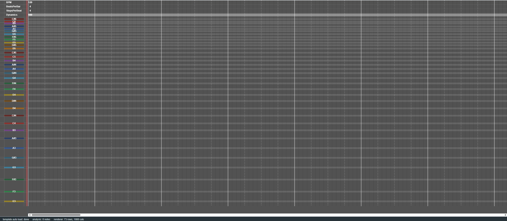

<strong>3.1. 화면 구조</strong>

| 영역 | 설명 |
| --- | --- |
| Row label | 각 행의 음높이, global row, gap row 같은 정보를 표시합니다. |
| Score canvas | 실제 note cell과 global cell이 표시되는 영역입니다. |
| Playback line | 현재 재생 위치를 시각적으로 보여주는 기준선입니다. |
| Scroll area | 긴 악보를 가로 / 세로로 이동하며 볼 수 있습니다. |

가로 방향은 시간의 흐름을 의미합니다. 세로 방향은 악보의 row 구조를 의미합니다.

<strong>3.2. 행의 종류</strong>

| 종류 | 설명 |
| --- | --- |
| note row | 실제 음표가 입력되는 줄입니다. 오타마톤의 음높이와 대응됩니다. |
| global row | BPM, 박자, dynamics처럼 악보 전체 흐름에 영향을 주는 값을 입력하는 줄입니다. |
| gap row | 음 사이의 시각적 간격을 만들기 위한 줄입니다. 일반적으로 직접 노트를 입력하지 않습니다. |

처음에는 note row에 일반 노트를 입력하고, global row는 BPM 같은 기본값을 확인하는 정도로 사용하는 것을 권장합니다.

<strong>3.3. 악보 보기</strong>

- 긴 악보는 가로 스크롤로 이동합니다.
- 높은 음 / 낮은 음은 세로 스크롤로 이동합니다.
- `View` 메뉴의 `Zoom`, `Speed`, `Fit Height`를 이용해 보기 편한 크기로 조정할 수 있습니다.
- `Text off`를 사용하면 note 위의 텍스트 표시를 줄여 더 깔끔한 악보를 볼 수 있습니다.

주의: 매우 긴 악보는 기기 성능에 따라 스크롤이나 렌더링이 느려질 수 있습니다.

<strong>4. Edit Mode 기본</strong>

Edit Mode는 악보 cell을 직접 수정하기 위한 모드입니다. 악보를 처음 작성한다면 기본 note 입력과 삭제, Undo / Redo부터 익히는 것을 권장합니다.

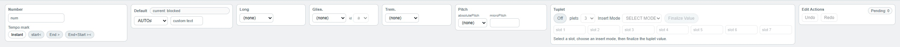

<strong>4.1. 기본 사용 흐름</strong>

1. `Edit Mode`를 켭니다.
2. `Track` 메뉴에서 수정할 track을 확인합니다.
3. 입력 도구에서 원하는 값을 선택합니다.
4. 악보 영역의 cell을 클릭합니다.
5. 선택한 입력값이 현재 active track의 cell에 기록됩니다.

주의: 여러 track을 동시에 켠 상태에서 입력하면 활성화된 여러 track에 함께 입력될 수 있습니다. 편집 전 Track 상태를 확인하세요.

<strong>4.2. 지우기와 되돌리기</strong>

| 항목 | 설명 |
| --- | --- |
| 빈 입력 / 삭제 도구 | 선택한 cell의 내용을 비웁니다. |
| Delete / Backspace | 선택 영역 또는 선택된 cell을 지울 때 사용합니다. |
| Undo | 최근 편집을 되돌립니다. |
| Redo | 되돌린 편집을 다시 적용합니다. |

Undo / Redo 기록은 현재 세션 안에서만 유지됩니다. 악보 파일을 새로 불러오거나 구조가 크게 바뀌면 초기화될 수 있습니다.

<strong>4.3. 범위 선택과 복사</strong>

`Ctrl + drag`로 여러 cell을 한 번에 선택할 수 있습니다.

| 조작 | 설명 |
| --- | --- |
| Ctrl + drag | 여러 cell 범위를 선택합니다. |
| Delete / Backspace | 선택한 범위의 cell을 삭제합니다. |
| Ctrl + C | 선택한 범위를 내부 clipboard에 복사합니다. |
| Ctrl + V | 복사한 범위를 현재 위치에 붙여넣습니다. |
| Ctrl + X | 잘라내기 기능입니다. |

붙여넣기 전에는 preview rectangle이 표시됩니다. 이 복사 기능은 SPRED 내부 score cell 복사용이며, 일반 텍스트 편집기의 복사 / 붙여넣기와 완전히 같지는 않습니다.

<strong>5. 입력 기호와 표현</strong>

SPRED의 note cell은 연주 표현을 추가하기 위한 여러 기호를 포함할 수 있습니다.

<strong>5.1. 기본 입력</strong>

| 항목 | 설명 |
| --- | --- |
| 기본 note | 일반 음표를 입력합니다. |
| comment | 실제 음 없이 악보 위에 표시할 설명을 입력합니다. |
| custom text | 사용자가 직접 정한 텍스트를 cell에 입력합니다. |

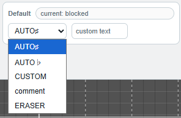

처음 악보를 만들 때는 일반 note와 간단한 텍스트 입력부터 사용하는 것을 권장합니다.

<strong>5.2. 롱노트와 표현 기호</strong>

| 기호 / 기능 | 설명 |
| --- | --- |
| `-` | 일반 롱노트 연결에 사용합니다. |
| `~` | vib가 있는 롱노트 표현에 사용합니다. |
| gliss marker | 글리산도 연결을 표현합니다. |
| trem marker | 트레몰로 표현에 사용합니다. |
| Pitch | 표시된 row와 실제로 울릴 음정을 다르게 지정하거나, cent 단위 미분음을 입력할 때 사용합니다. |

Pitch는 주로 배음처럼 손가락 위치와 실제 발음이 다른 경우, 예외적인 음 처리, 미분음 표현에 사용합니다.

기호 조합은 가능하지만, 음악적으로 동시에 해석하기 어려운 조합은 제한되거나 일부만 해석될 수 있습니다.

<strong>5.3. Glissando 입력</strong>

Glissando는 시작 지점, 중간 지점, 끝 지점을 이어 음높이가 미끄러지듯 변하는 표현입니다.

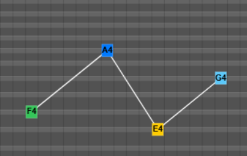

| 항목 | 설명 |
| --- | --- |
| Gliss kind | gliss marker의 역할을 고릅니다. 기본 흐름은 start - mid - end 순서입니다. |
| start | 글리산도가 시작되는 지점입니다. |
| mid | 시작과 끝 사이를 지나는 중간 지점입니다. 필요할 때 여러 개를 둘 수 있습니다. |
| end | 글리산도가 끝나는 지점입니다. |
| Gliss id | 같은 id를 가진 marker끼리 하나의 glissando로 연결됩니다. |

서로 다른 glissando를 동시에 쓰거나 가까운 위치에 배치할 때는 id를 다르게 지정해 연결이 섞이지 않도록 합니다.

주의: 같은 id 안에서는 start - mid - end 순서가 자연스럽게 이어져야 합니다. 순서가 뒤섞이거나 end가 없는 경우 의도와 다르게 해석될 수 있습니다.

<strong>5.4. Tuplet 입력</strong>

Tuplet은 한 칸 안을 여러 분할음으로 나누어 셋잇단음 같은 리듬을 표현하는 기능입니다. 입력 과정이 다른 도구보다 복잡하므로, 먼저 tuplet 값을 만든 뒤 악보에 배치하는 흐름으로 이해하면 됩니다.

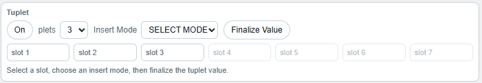

| 항목 | 설명 |
| --- | --- |
| Tuplet mode | Tuplet 입력 모드를 켜거나 끕니다. 이 모드에서는 tuplet 관련 입력을 우선 사용합니다. |
| Division | 한 칸을 몇 개의 분할음으로 나눌지 정합니다. 예를 들어 3이면 셋잇단음 계열 입력입니다. |
| Insert mode | 각 분할 슬롯에 어떤 방식으로 값을 넣을지 정합니다. 선택한 기본 note, 롱노트, 표현 기호 설정이 함께 반영될 수 있습니다. |
| Slot | 분할음 하나하나의 입력칸입니다. 현재 선택된 slot에 note나 쉼표 값을 넣습니다. |
| Select row | 악보의 row를 클릭해 현재 slot에 해당 음높이를 넣는 방식입니다. |
| Finalize Value | slot에 입력한 분할음 구성을 확정합니다. 확정 후 악보 cell을 클릭해 tuplet을 배치합니다. |

기본 순서는 아래와 같습니다.

1. `Tuplet mode`를 켭니다.
2. `Division`에서 분할 수를 고릅니다.
3. 입력할 slot을 선택합니다.
4. `Select row` 또는 입력 도구를 사용해 각 slot의 음을 채웁니다.
5. 쉼표가 필요한 slot은 빈 값으로 둡니다.
6. 모든 slot을 정했으면 `Finalize Value`를 누릅니다.
7. 악보 영역의 원하는 cell을 클릭해 tuplet을 입력합니다.

주의: Tuplet은 여러 분할음이 하나의 cell 안에 들어가는 구조입니다. 이미 입력된 tuplet을 수정할 때는 일반 note보다 hit 영역과 slot 선택을 더 주의해서 확인하세요.

<strong>5.5. Pitch 입력</strong>

Pitch 영역은 악보에서 클릭한 row의 기본 음높이를 기준으로, 실제 발음 음정과 미세한 cent 보정을 따로 지정하는 기능입니다.

| 항목 | 설명 |
| --- | --- |
| absolutePitch | 실제로 울릴 음정을 계이름 드롭다운으로 지정합니다. 비워두면 클릭한 note row의 기본 음정을 그대로 사용합니다. |
| AUTO◇ +2oct | 클릭한 row보다 2옥타브 높은 음정을 자동으로 지정합니다. 배음 표기처럼 표시 위치와 실제 발음이 달라지는 경우에 사용합니다. |
| microPitch | 현재 음정에서 cent 단위로 미세하게 올리거나 내립니다. 입력 범위는 -100부터 100까지이며, 소수점 이하 1자리까지 사용할 수 있습니다. |

기본 입력 순서는 아래와 같습니다.

1. `Edit Mode`를 켭니다.
2. 필요하면 `absolutePitch`에서 실제 발음 음정을 고릅니다.
3. 미분음이 필요하면 `microPitch`에 cent 값을 입력합니다.
4. 악보 영역의 원하는 note row와 cell을 클릭합니다.

예를 들어 표시 위치는 낮은 음 row에 두되 실제 소리는 배음처럼 높은 음으로 내고 싶다면 `absolutePitch` 또는 `AUTO◇ +2oct`를 사용합니다. 기준 음보다 조금 높거나 낮게 연주해야 하는 음은 `microPitch`에 양수 또는 음수 cent 값을 넣습니다.

주의: Pitch modifier는 표시 위치, 재생 음정, practice mode 판정에 영향을 줄 수 있습니다. 의도한 음정과 다르게 들리면 먼저 absolutePitch와 microPitch 값이 남아 있는지 확인하세요.

<strong>6. Layout 사용</strong>

Layout은 악보의 세로 구조, 음높이 행, gap row, row height 등을 정하는 기능입니다.

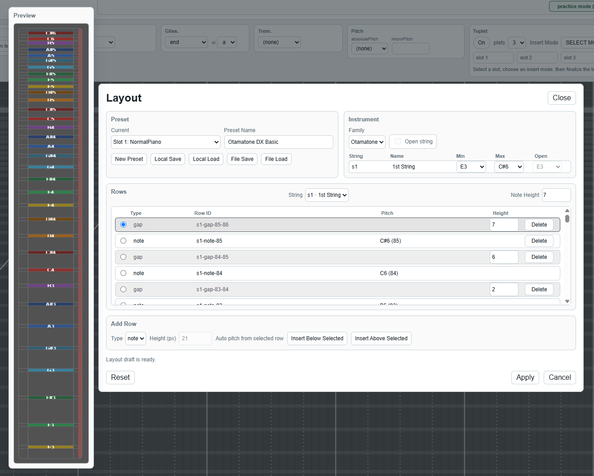

<strong>6.1. Layout이 하는 일</strong>

| 항목 | 설명 |
| --- | --- |
| Instrument | 악기 종류와 string 설정을 관리합니다. |
| Rows | 현재 악보 row 목록을 확인하고 수정합니다. |
| Preview | 수정 중인 layout을 미리 봅니다. |
| Add Row | note row 또는 gap row를 추가합니다. |
| Apply | 수정한 layout을 현재 악보에 적용합니다. |

Layout은 악보 구조와 직접 연결되어 있으므로, 처음에는 row height 조정이나 preset 확인 정도부터 사용하는 것을 권장합니다.

<strong>6.2. Preset 저장과 불러오기</strong>

| 항목 | 설명 |
| --- | --- |
| New Preset | 현재 설정을 새 preset으로 만듭니다. |
| Local Save / Local Load | 현재 브라우저에 layout preset을 저장하거나 불러옵니다. |
| File Save / File Load | layout preset을 파일로 저장하거나 파일에서 불러옵니다. |

악보 파일은 기본 layout을 저장하고, 사용자의 layout custom은 별도 preset으로 관리하는 방향입니다.

<strong>6.3. 주의할 점</strong>

- row를 삭제하거나 종류를 바꾸면 기존 cell과 충돌할 수 있습니다.
- 구조 충돌이 큰 경우 apply 또는 import가 실패할 수 있습니다.
- 악보가 이상하게 보이면 먼저 layout preset과 row 구조를 확인하세요.
- 불확실할 때는 `JSON Download`로 악보를 백업한 뒤 layout을 수정하세요.

<strong>7. Practice Mode Beta</strong>

Practice Mode Beta는 마이크 입력을 사용하여 악보와의 일치도를 측정하고, 음정과 박자 감각을 확인하는 연습 보조 기능입니다.

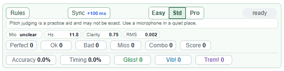

<strong>7.1. 시작 방법</strong>

1. 연습할 악보를 불러옵니다.
2. 연습할 track을 확인합니다.
3. `practice mode (beta)`를 누릅니다.
4. 브라우저가 마이크 권한을 요청하면 허용합니다.
5. 필요하면 `Sync`로 입력 지연을 조정합니다.
6. 재생을 시작합니다.

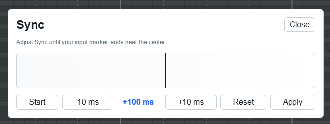

Practice mode 중에는 악보 교체, 편집, layout 변경 같은 일부 기능이 잠깁니다. 연습 중 점수 계산 기준이 바뀌는 것을 막기 위한 동작입니다.

<strong>7.2. 판정 표시</strong>

세부 내용은 Practice 모드 윈도우 좌상단의 Rules에서 확인할 수 있습니다.

| 표시 | 설명 |
| --- | --- |
| Perfect | pitch와 timing이 잘 맞은 경우입니다. |
| Ok | 어느 정도 맞은 경우입니다. |
| Bad | 많이 벗어난 경우입니다. |
| Miss | 판정 기준을 크게 벗어난 경우입니다. |
| COMBO | 연속 성공 수를 표시합니다. |

결과창에서는 pitch accuracy, timing accuracy, total score, max combo, 각 판정 개수 등을 확인할 수 있습니다.

<strong>7.3. 인식이 이상할 때</strong>

- 조용한 장소에서 테스트하세요.
- 브라우저가 올바른 마이크를 사용하고 있는지 확인하세요.
- 너무 작은 소리나 주변 소음은 pitch detection을 방해할 수 있습니다.
- 스피커 소리가 마이크에 크게 들어가면 판정이 흔들릴 수 있습니다.

주의: Practice Mode Beta는 엄밀한 판정을 갖춘 게임이 아닌 단순 연습 보조 기능입니다. 결과가 부정확할 수 있습니다.

<strong>8. 보안과 개인정보</strong>

<strong>8.1. 개인정보 입력 주의</strong>

- 악보 metadata나 comment에 민감한 개인정보를 적지 마세요.
- 공용 PC에서는 `Local Save` 사용을 피하거나 테스트 후 브라우저 데이터를 정리하세요.
- local storage에 저장한 데이터는 같은 브라우저 사용자에게 보일 수 있습니다.

<strong>8.2. 파일과 access word</strong>

- 모르는 사람이 준 JSON 파일은 신뢰할 수 있는 출처인지 확인하세요.
- 전문가나 AI 에이전트의 도움을 빌려 안전성을 검사하는 것도 좋습니다.

<strong>10. 용어 정리</strong>

앱 안에서 반복되는 용어를 간단히 정리합니다.

| 용어 | 설명 |
| --- | --- |
| Score JSON | SPRED 악보 데이터를 저장하는 JSON 파일입니다. |
| cell | 악보의 한 칸입니다. |
| note cell | 실제 음표 또는 연주 기호가 들어가는 칸입니다. |
| global cell | BPM, 박자, dynamics 같은 전체 흐름 값을 적는 칸입니다. |
| track | basic / optional / extra로 나뉘는 악보 레이어입니다. |
| layout | 악보 row 구조와 높이, 음높이 배치를 정하는 정보입니다. |
| preset | 저장해두고 다시 불러올 수 있는 layout 설정입니다. |
| tick | SPRED 내부에서 시간 위치를 세는 단위입니다. |
| BPM | 분당 박자 수입니다. |
| offset | 영상 또는 입력 타이밍을 악보와 맞추기 위한 시간 차이입니다. |
| manifest | 예제 DB에서 악보 목록을 표현하는 정보입니다. |
| practice mode | 마이크 입력으로 연습 판정을 표시하는 beta 기능입니다. |

